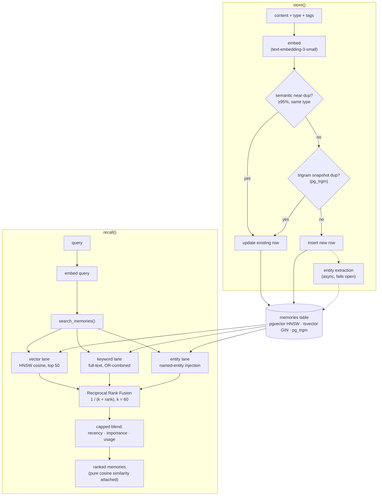

# Agent Memory on Supabase

Long-term memory for AI agents, built on plain Postgres. Vector search and
full-text search fused with Reciprocal Rank Fusion, entity-grounded recall,
temporal validity, and trigram-based dedup. No new database to run, no vendor
lock-in, no opaque service between your agent and its memories. It is a table,
a few functions, and a small client. **You own the SQL and the rows.**

```js
import { MemoryStore } from "agent-memory-supabase";

const mem = new MemoryStore({
  supabaseUrl: process.env.SUPABASE_URL,
  supabaseKey: process.env.SUPABASE_SERVICE_ROLE_KEY,
  openaiKey:   process.env.OPENAI_API_KEY,
});

await mem.store({ content: "User prefers figures in GBP.", memoryType: "preference" });

const hits = await mem.recall("what currency should I use?");
// [{ content: "User prefers figures in GBP.", memory_type: "preference", similarity: 0.83, ... }]
```

## Why I built this

I didn't set out to build a memory product primarily. When Anthropic banned OpenClaw usage through subscriptions I decided to just build my own agent/harness/OS and build it a proper database memory to see if I could create something better than what Claw/Hermes ship with. I created a fresh version of the memory system in isolation and have open sourced it. That is this repo :)

Ok here's more detail on the memory (written by AI so forgive the tone

I built the memory layer as **Postgres you can read**. It runs on Supabase
because Supabase is just Postgres with pgvector, `pg_trgm`, and row-level
security already in the box, which is exactly what a real memory system needs
and exactly what the hosted tools hide from you. After months of it running a
real life in production, 22,000+ memories deep, I extracted the core into this
template. The scars in the comments (why `updated_at` must not move on reads,
why one function overload silently broke dedup for months) are real, and they
are why the design is shaped the way it is.

## What this does that other memory systems don't

Most agent-memory layers are a vector database with a summariser in front.
This is a different shape:

- **Retrieval is a SQL function, not a service.** Every ranking decision lives
  in one readable PL/pgSQL function you can open, `EXPLAIN`, profile, and tune.
  When recall goes wrong, it is a debugging session, not a support ticket.
- **Three recall lanes, not one.** Pure vector search misses exact names, IDs,
  and rare keywords; pure keyword search misses paraphrase. This fuses vector,
  full-text, and a third **entity lane** that injects memories about people,
  projects, and tools named in the query even when neither of the other lanes
  finds them. Identity facts stop falling through the cracks.
- **Facts have a timeline, not just an embedding.** A `superseded_by` chain
  plus `valid_from` / `valid_until` windows means facts evolve without
  deletion, and `memory_history()` replays how one changed over time. Most
  systems either overwrite (history lost) or append (contradictions pile up).
- **Dedup happens at write time, twice.** A ≥95% semantic near-duplicate of the
  same type updates in place instead of accumulating. A separate `pg_trgm` pass
  catches "same template, changed values" snapshots that slip under the
  embedding threshold. Your store stays clean without a compaction job.
- **Memory types with teeth.** Nine types (fact, decision, preference,
  correction, pattern, learning, event, conversation, transcript), and the
  type changes behaviour: corrections and preferences never decay in ranking,
  transcripts stay out of keyword search, dedup never collapses a `decision`
  into a `fact`.
- **Honest scores.** RRF plus small capped recency / importance / usage
  factors decide the *order*, but the `similarity` returned to you is untouched
  cosine, so it stays meaningful as a threshold. Flip `use_blended` off for a
  clean RRF baseline when you A/B retrieval.
- **Zero new infrastructure.** If you have a Supabase project, you already run
  everything this needs. One schema file, RLS templates included, no hosted
  dependency beyond an embedding provider.

## How it works



One table holds everything. Writes go through dedup before they land; reads
fan out across three candidate lanes and get fused back into one ranked list.
The full ranking walkthrough is in [How recall works](#how-recall-works).

## Install

```bash
npm install agent-memory-supabase @supabase/supabase-js
```

Then, once:

1. Run [`sql/schema.sql`](sql/schema.sql) in the Supabase SQL editor. It is safe
   to re-run.
2. (Recommended) Run [`sql/rls.sql`](sql/rls.sql) and pick a security posture.
3. `cp .env.example .env` and fill in your Supabase URL, **service role** key,
   and OpenAI key.

```bash
node examples/quickstart.js
```

## How recall works

`recall()` embeds your query and calls the `search_memories` SQL function, which
runs three candidate lanes and fuses them:

1. **Vector lane**: top 50 by cosine similarity over the HNSW index.
2. **Keyword lane**: full-text matches on a generated `tsvector`, OR-combined
   so natural-language queries match broadly, ranked by relevance then importance.
3. **Entity lane**: when the query names a known entity, that entity's top
   memories are injected even if neither of the first two lanes found them.

The three lanes are merged with Reciprocal Rank Fusion (`1 / (k + rank)`,
`k = 60`), then nudged by small capped factors: recency (exponential decay,
floored so old-but-relevant memories lose at most 25%, and preferences /
corrections never decay), importance, and how often a memory has actually been
returned before. The `similarity` you get back is untouched cosine, so it stays
meaningful as a "how close is this" score; the fusion score is used only for
ordering. All of this is one readable PL/pgSQL function you can open and tune.

## API

```js
const mem = new MemoryStore({ supabaseUrl, supabaseKey, openaiKey });

// Store. Dedups against a >=95% same-type near-duplicate. Returns {action, memory}.
await mem.store({
  content: "Decided to migrate memory retrieval to hybrid RRF.",
  memoryType: "decision",          // one of the nine types
  project: "myapp",                // optional namespace / tenant
  tags: ["retrieval"],             // optional
  importance: 7,                   // optional; sensible per-type default otherwise
  supersedes: "uuid-of-old-fact",  // optional; closes the old fact's validity window
});

// Recall. Hybrid by default; returns rows with real cosine `similarity`.
await mem.recall("how do we rank memories?", {
  project: "myapp",
  matchCount: 10,
  types: ["decision", "learning"], // optional type filter
  namedEntities: ["Kern"],         // optional entity grounding
});

// Recent entries, newest first.
await mem.timeline({ project: "myapp", limit: 20 });

// How a fact evolved over time (supersedes chain + validity windows).
await mem.history("retrieval");
```

## Design choices worth knowing

- **1536-dim embeddings** (OpenAI `text-embedding-3-small`) by default. To use a
  different model, change the `vector(1536)` width in `schema.sql` and the model
  in `src/client.js`; everything else is model-agnostic.
- **Service role, server side.** The client uses the service_role key and is
  meant to run on a server. For browser or multi-tenant use, enable RLS with an
  owner column (see `sql/rls.sql`, posture B) and swap to a scoped key.
- **Entity extraction is optional and non-blocking.** It uses a cheap model and
  fails open: a write never fails because entity extraction did. Pass
  `extractEntities: false` to the constructor to turn it off entirely.
- **Dedup is type-aware.** A paraphrased `fact` can collapse into an existing
  `fact`, but never overwrite a `decision`. This was a real bug once; the type
  filter is the fix.

## Roadmap

- Optional cross-encoder reranker hook (the production system uses one; the
  template ships without it to stay dependency-light).
- Python client.
- Packaging as a Supabase Edge Function and as an MCP server, so any
  MCP-speaking agent gets memory with zero glue.

## License

MIT. Built by [Rees Calder](https://reescalder.com).
